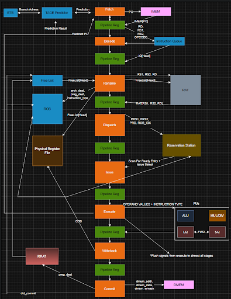

# Out-of-Order RV32IM Processor

A synthesizable SystemVerilog RV32IM processor core that implements single-issue out-of-order execution with explicit register renaming and precise retirement.

This repository documents the processor architecture, RTL organization, verification strategy, performance optimization, and synthesis results.

## Headline Results

| Metric | Result |
|:---:|:---:|
| CoreMark IPC | 0.6198 |
| Synthesis Timing | 100 MHz target met with +7.2 ps worst-case setup slack |
| Synthesized Cell Area | 439,721 µm² (0.440 mm²) |
| ISA Support | RV32IM |

IPC was measured over the complete CoreMark run. Timing and area are post-synthesis, pre-layout estimates.

## Architecture Diagram

  

## Design Overview

The processor fetches and decodes instructions in order, renames architectural registers into a larger physical register file, dynamically schedules ready instructions, executes them out of order, and retires them in program order through the reorder buffer.

See [`docs/architecture.md`](docs/architecture.md) for the full architecture walkthrough.

## Technical Highlights

- Explicit register renaming using a 64-entry physical register file, RAT, RRAT, and free list
- 32-entry age-ordered reservation station with same-cycle CDB wakeup and balanced logic for selecting the oldest ready instruction
- Split 8-entry load/store queues with out-of-order load scheduling and store-to-load forwarding using byte masks
- TAGE predictor paired with a 256-entry BTB, achieving a 0.936% branch-flush rate and 1.71-cycle average frontend recovery
- Direct I-cache response bypass when the instruction queue was empty used during 56.87% of execution cycles

## Performance Optimization

The final design was developed through repeated measurement and targeted refinement. A custom profiler collected performance counters at key pipeline stages and shared resources to identify the dominant bottlenecks. These counters measured issues such as frontend stalls and contention in the instruction window, guiding each round of RTL optimization.

Major optimization work included:

- Expanding the ROB and reservation station from 16 to 32 entries to increase the number of instructions available for out-of-order scheduling
- Allowing loads to execute ahead of nonconflicting older stores and forwarding matching store data directly to dependent loads
- Removing unnecessary pipeline bubbles so independent instructions could move through issue and execution in consecutive cycles
- Redesigning the reservation station to select the oldest ready instruction with timing-friendly balanced trees

See [`docs/performance_analysis.md`](docs/performance_analysis.md) for a detailed analysis of the processor’s performance and the optimizations that improved it.

## Verification and Debugging

Verification used Spike for commit-by-commit architectural checking and benchmarks such as `coremark_im` and `aes_sha` for full-program correctness and performance testing.

See [`docs/verification_and_debugging.md`](docs/verification_and_debugging.md) for debugging examples and details on directed and full-program benchmark verification.

## Synthesis

The processor was synthesized using Synopsys Design Compiler with a FreePDK45/Nangate standard-cell flow and SRAM cache macros.

The final implementation met the 10 ns clock target and occupied 439,721 µm² of synthesized cell area. See [`docs/synthesis_results.md`](docs/synthesis_results.md) for a detailed analysis of the processor’s synthesis results, timing behavior, and area utilization.

## Repository Structure

| Path | Description |
|---|---|
| [`rtl/`](rtl/) | SystemVerilog RTL organized by processor subsystem |
| [`rtl/top/`](rtl/top/) | Top-level CPU integration |
| [`rtl/packages/`](rtl/packages/) | Shared package definitions and structures |
| [`rtl/frontend/`](rtl/frontend/) | Fetch, instruction queue, TAGE, and BTB logic |
| [`rtl/rename/`](rtl/rename/) | Decode, rename, dispatch, RAT, RRAT, PRF, and freelist |
| [`rtl/dispatch/`](rtl/dispatch/) | Reservation station, wakeup, and issue selection |
| [`rtl/execute/`](rtl/execute/) | Execute, multiply/divide integration, and result queue |
| [`rtl/memory/`](rtl/memory/) | Load/store queues, cache, and memory arbiter |
| [`rtl/commit/`](rtl/commit/) | Reorder buffer and writeback |
| [`docs/`](docs/) | Architecture, optimization, verification, and synthesis documentation |
| [`reports/`](reports/) | Supporting profiler and synthesis reports |
| [`images/`](images/) | Diagrams, waveforms, and report screenshots |

## Repository Scope

This repository is intended for architecture review and technical discussion. It is not packaged as a standalone runnable environment. Do not submit any portion of this implementation as academic coursework.
