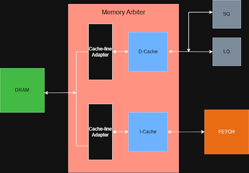

# Architecture Overview

This project implements a synthesizable, single-issue RV32IM processor core based on an explicit register renaming architecture.

At a high level, an in-order frontend feeds a dynamically scheduled, out-of-order execution backend. Architectural registers are renamed into a larger physical register namespace, allowing independent instructions to execute out of order while the reorder buffer preserves precise in-order retirement.

  

  <em>Final RV32IM out-of-order processor datapath.</em>

## Core Configuration

| Structure | Configuration |
|:---:|:---:|
| Reorder buffer | 32 entries |
| Reservation station | 32 entries |
| Architectural registers | 32 |
| Physical registers | 64 |
| Load queue | 8 entries |
| Store queue | 8 entries |
| Execution-result queue | 4 entries |
| TAGE predictor | 2,048-entry base table + four 128-entry tagged tables |
| Branch target buffer | 256 entries |
| Issue width | 1 instruction/cycle |
| Retirement width | 1 instruction/cycle |

## Frontend and Branch Prediction

The frontend consists of a fetch stage supported by a TAGE branch predictor and a branch target buffer. TAGE predicts branch direction, while the BTB supplies the predicted target address for taken control-flow instructions.

Fetch uses these predictions to select the next PC, request the corresponding instruction from the I-cache, and forward it toward decode through the instruction queue. When a branch or jump is resolved in execute, its actual direction and target are compared with the stored prediction metadata, and any mismatch triggers a redirect and pipeline recovery. TAGE is trained from committed conditional branches, while the BTB records targets from resolved taken branches.

The fetch path also implements an empty-queue bypass that forwards an arriving I-cache response directly toward decode when the instruction queue is empty and downstream logic can accept it. This removes the otherwise required enqueue-and-dequeue cycle.

## Rename, Dispatch, and Retirement

After decode, each instruction’s architectural source registers are looked up in the register alias table to find the physical registers holding their current values. Instructions that write a destination register receive a newly allocated physical register from the free list, while the previous mapping is saved for later retirement.

The reorder buffer tracks every in-flight instruction’s program order, completion status, and recovery information. For register-writing instructions, it also stores the architectural destination and the old and new physical mappings. The renamed instruction is then dispatched to the reservation station, where it waits until its operands and required execution unit are available.

Although instructions execute out of order, they commit strictly in order through the ROB. On commit, the RRAT is updated for register-writing instructions, and the old physical mapping is returned to the free list once it is no longer live.

## Reservation Station and Issue

Ready instructions are selected from a unified reservation station using an age-ordered issue policy based on distance from the ROB head. This keeps scheduling behavior tied to program age while still allowing younger ready instructions to execute before older stalled instructions.

The final reservation station uses balanced selection logic rather than a serial priority chain. This preserves oldest-ready issue behavior and same-cycle CDB wakeup while keeping the scheduler structure more timing-friendly.

## Execute and Writeback

Issued instructions are routed to the appropriate functional unit based on decoded control signals. Integer register and immediate instructions use the ALU, branches and jumps are resolved in execute, and RV32M instructions are sent to the multiply or divide path.

  

  <em>Multiplication instruction pathway with parallel metadata tracking.</em>

The multiplier uses a pipelined functional unit with a parallel metadata path so that the computed result stays aligned with the instruction’s destination tag and ROB index. The divider is treated as a sequential unit, and divide instructions issue only when the divider is available.

Register-producing execution results and load results write the physical register file and broadcast availability through the common data bus so dependent reservation-station entries can wake up. Stores and control-flow instructions complete through their corresponding completion paths without necessarily writing the PRF.

## Memory Subsystem

The memory system uses separate instruction and data cache paths. The same pipelined cache structure is instantiated as both the I-cache and D-cache, with each cache connected to DRAM through a cache-line adapter.

  

  <em>Memory subsystem with I-cache, D-cache, cache-line adapters, and memory arbitration.</em>

Each cache-line adapter fills a 256-bit cache line using 64-bit bursts from DRAM. Since the instruction and data caches share one DRAM interface, a memory arbiter selects which cache path may access DRAM at a given time. The arbiter services one miss or writeback path at a time and gives non-preemptive priority to the D-cache path when arbitration occurs.

## Load/Store Queues

Memory operations are managed through separate load and store queues. Stores collect their address, data, and byte mask while speculative, but they do not update memory until they commit.

Loads may execute before older stores when the store queue determines there is no address conflict. If an older store overlaps the load at the byte-mask level and all required bytes are available, the store queue can forward data directly to the load, bypassing cache storage.

The load queue searches all waiting loads and executes the oldest one whose address is ready and whose dependencies on older stores have been resolved. This allows independent loads to proceed without violating memory ordering.

## Branch Recovery

When a branch or jump is mispredicted, fetch redirects to the correct PC and all younger wrong-path work is discarded. Rename recovery starts from the committed mappings in the RRAT, preserves mappings created by older surviving instructions, and returns physical registers used only by flushed instructions to the free list.

Each in-flight instruction in the ROB is compared by age relative to the mispredicted branch. Instructions older than the branch are preserved, while younger instructions are flushed.
