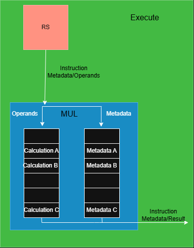

# Verification and Debugging

Verification combined full-program benchmarks, commit-by-commit checking against Spike, directed assembly tests, module-level testbenches, and waveform analysis in Verdi. When a benchmark failed, the mismatch was reduced to a smaller test so the relevant instructions could be traced cycle by cycle.

The final processor passed `coremark_im`, `aes_sha`, `compression`, `fft`, `mergesort`, and `image`.

## Representative Bugs and Fixes

### Free List Recovery Leak

The most difficult failure appeared only after more than 300,000 CoreMark commits. During some branch flushes, physical registers associated with instructions retiring in the same cycle were not returned to the free list. Those registers remained marked as unavailable even though the instructions had already committed, so repeated flushes gradually exhausted the available register pool and eventually stalled rename.

Recovery was changed to rebuild the free list from the registers that were actually still live, including committed architectural mappings and mappings referenced by older surviving instructions. Every other physical register could then be safely returned to the free list.

### Stale Flush Requests

A delayed flush request could reach the ROB after the branch that generated it had already retired or been removed. Because ROB entries are reused, that same index could later belong to a different instruction. Applying the stale request would then make recovery act on the wrong point in program order and flush or preserve the wrong instructions.

The ROB was changed to accept a flush only when the supplied index still identified a valid in-flight instruction. This prevented an old misprediction from being applied after its ROB entry had been reused.

### Multiplier Metadata Alignment

The original multi-cycle multiplier delayed the product for several cycles, while the instruction metadata could advance or be replaced independently. During stalls or closely spaced multiply instructions, the result could therefore be paired with the wrong ROB index or destination register.

The final design used a pipelined multiplier with a parallel metadata pipeline of the same latency. The product and its ROB index and destination register advanced together, keeping them aligned through writeback.

  

  <em>Multiplication instruction pathway with parallel metadata tracking.</em>

### Commit During a Flush

An older store could retire from the ROB in the same cycle that a branch flush occurred, but the store queue’s flush handling could prevent its committed bit from being set. Because the ROB had already retired the instruction, the store would never receive another commit signal and could not be written to memory.

The flush logic was corrected to preserve the same-cycle commit while removing only younger wrong-path stores. This prevented retired stores from becoming permanently stranded in the store queue.
